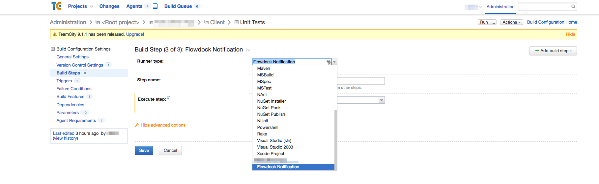

# FlowdockNotify

This is used by the build agent to notify the person who (most likely)
started the build that their build is complete, whether or not it failed
or passed.

The teamcity api is used to fetch information about the build because we
cannot find it out in the environment.

## Installation

1. Add this gem to your Gemfile

2. Set up a TeamCity account with access to all the projects being reported on 
   and a Flowdock account with access to your team's flow - it will be the
   account sending messages to your team members. Put these bots'
   credentials into the configuration below.

2. Make a `.flowdock_build_notifier.yml` file in the root of your project. An
   example is given below: 

   ```yaml
   flowdock_user_token: SECRET_FLOWDOCK_USER_TOKEN
   flow_name: FLOW_NAME

   teamcity_url: https://teamcity.your_account.com
   teamcity_user: SECRET_TEAMCITY_USER_NAME
   teamcity_password: SECRET_TEAMCITY_USER_PASSWORD

   email_map:
     miranda@gmail.com: miranda@company.com
     jj@gmail.com: jacobson@company.com
   ```

   For privacy, you should put this file in your .gitignore.
   Alternatively, TeamCity login information and flowdock user token can be left
   out of the yaml configuration file by assigning the following ENV variables 
   on TeamCity if you prefer.

   ```
   ENV['FLOWDOCK_USER_TOKEN']
   ENV['FLOWDOCK_NOTIFIER_TEAMCITY_USER']
   ENV['FLOWDOCK_NOTIFIER_TEAMCITY_PASSWORD']
   ```

   The email map is used to connect the author of the last commit to the
   corresponding Flowdock account.

3. Under project settings on TeamCity, upload the following xml document as a
   meta-runner: 

   ```xml
   <?xml version="1.0" encoding="UTF-8"?>
   <meta-runner name="Flowdock Notify">
     <description>Notify build status via flowdock</description>
     <settings>
       <parameters />
       <build-runners>
         <runner name="" type="simpleRunner">
           <parameters>
             <param name="command.executable" value="bundle exec flowdock_notify" />
             <param name="command.parameters" value="%teamcity.build.id%" />
             <param name="teamcity.step.mode" value="default" />
           </parameters>
         </runner>
       </build-runners>
       <requirements />
     </settings>
   </meta-runner>
   ```

   


4. Set up your build configuration steps to run `bundle install`
   initially. Make a final step which executes the notifier meta-runner
   regardless of previous failures.

   
   

5. If you want a particular build to report failure in the main flow instead of
   private messages, set `ENV['FLOWDOCK_NOTIFY_ALL_ON_FAILURE']` to true.
